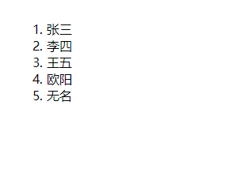
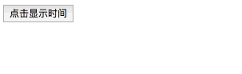
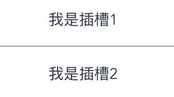

# Vue语法简介
## 一、v-的属性及方法
####1.v-html绑定HTML代码
使用 v-html 指令用于输出 html 代码：
```html
<div id="app">
    <div v-html="message"></div>
</div>
```
```html
new Vue({
    el: "#app",
 	  data: {
  		  message: "<h1>Hello, world!</h1>"
 	  }
})
```
输出结果如下：
```html
<div id="app">
    <div>
    <h1>Hello, world!</h1>
</div>
</div>
```
#### 2.v-model(数据的双向绑定)
v-model通常用于数据的双向绑定，进而来实现数据共享：一般v-model主要用于绑定输入框，进而取值。
```html
<div id="modelOne">
<input v-model="message" placeholder="编辑">
<p>message 是：{{ message }}</p>
```
```js
new Vue({
  el:"#modelOne",
  data:{
    message:'';
  }
})
```
>如下图所示，通过在输入框输入不同的值，下面的p标签的内容也会跟随着input框值的变化而变化，进而实现了一个简单的数据双向绑定。

####3.v-if v-show v-for 列表条件渲染
(1).v-if  
 `v-if` 是条件渲染指令，它根据表达式的真假来删除和插入元素，它的基本语法如下：`v-if="expression"`  
`expression` 是一个返回`bool`值的表达式，表达式可以是一个`bool`属性，也可以是一个返回`bool`的运算式。
```html
<div id="app">
    <p v-if="yes">Hello, vue.js!</p>
    <p v-if="no">Hey, girl!</p>
    <p v-if="age > 18">Welcome!</p>
    <p v-if="name.indexOf('Henry') >= 0">Hello, {{ name }}!</p>
</div>
```
```js
export default {
  data() {
    return{
      yes: true,
      no: false,
      age: 16,
      name: "Henry Lee"
    }
  }
}
```
>呈现效果如下
```html
<div id="app">
    <p >Hello, vue.js!</p>
    <p >Hello, Henry Lee</p>
</div>
```
(2).v-else  
v-else 指令可以为 v-if 添加一个 else 模块：
```html
<div id="app">
    <p v-if="isRain">外面下雨了，我们在家玩王者荣耀吧？</p>
    <p v-else>今天天气不错，我们出去逛街吧？</p>
</div>
```
```js
export default {
  data() {
    return{
      isRain: false,
    }
  }
}
```
>页面显示：“今天天气不错，我们出去逛街吧？”  
(3)v-show  
另一个用于根据条件展示元素的选项是 v-show 指令。用法大致和`v-if`是一样的：
```html
<h1 v-show="ok">Hello!</h1>
```
不同的是带有 `v-show` 的元素始终会被渲染并保留在 DOM 中。v-show 只是简单地切换元素的 CSS 属性 `display:none`。  
v-if当条件判断为`false`，会实现真正的渲染，不会保留在DOM中
>注意，v-show 不支持 <template> 元素，也不支持 v-else。
(4).v-for 列表渲染  
所谓列表渲染就是将一个对象或者数组进行循环遍历，将其数据展示在页面上。
```html
<div id="app">
    <ol>
        <li v-for="(hero, index) in heros" key="index">
            <h3>{{ hero.name }}</h3>
        </li>
    </ol>
</div>
```
```js
export default {
  data() {
    return{
      heros: [
                  {name:"张三"},
                  {name:"李四"},
                  {name:"王五"},
                  {name:"欧阳"},
                  {name:"无名"}
              ]
    }
  }
}
```
页面展示效果如下:  
  
>注：我们请求后台数据，一般都是用`v-for`来将数据展示到页面上,配合`v-if`来实现不同权限的管理与显示。
####4.v-bind(绑定属性)
使用 `v-bind` 指令用于绑定属性：通过v-bind来动态的绑定一些属性(id,class,src等等)
```html
<div id="app">
    <div v-bind:id="idValue"></div>
</div>
```
```js
export  default {
  data(){
    return{
      idValue: "box"
    }
  }
}
```
```html
<!-- 显示结果 -->
<div id="app">
    <div id="box"></div>
</div>
```
####5.v-on绑定方法
v-on 指令可以绑定事件监听器，通过该监听器可以vue示例中定义的方法：
```html
<div id="app-5">
    <h3 v-text="time"></h3>
    <button type="button" v-on:click="showTime">点击显示时间</button>
</div>
```
```js
var app5 = new Vue({
   el:"#app-5",
   data: {
       time:""
   },
   methods: {
       showTime: function () {
           // this 指向vue实例
           this.time = "北京时间：" +  new Date().toLocaleString();
       }
   }
});
```
效果如下：  

>注：通常情况下，v-bind,v-on通常有两种缩写方式。  
v-bind缩写
```html
<!-- 完整语法 -->
<a v-bind:href="url"></a>
<!-- 缩写 -->
<a :href="url"></a>
```
v-on缩写
```html
<!-- 完整语法 -->
<a v-on:click="doSomething"></a>
<!-- 缩写 -->
<a @click="doSomething"></a>
```
## 二、子父组件的相互传值
####1.父传子(Prop 传递数据)
prop 是父组件用来传递数据的一个自定义属性。

父组件的数据需要通过 props 把数据传给子组件，子组件需要显式地用 props 选项声明 "prop"

我们也可以动态的绑定父组件传递的数据，然后子组件用props接收父组件传递的属性及属性值。
```html
// 父组件
<template>
    <div>
        父亲
        <!-- 父组件传递title属性值给子组件 -->
        <Son title="传递数据"/>
    </div> 
</template>
```
```html
/ 子组件
<template>
    <div>
        <!-- 显示父组件传递过来的数据 -->
        儿子：{{title}}
    </div> 
</template>

<script>
export default {
    name: "Son",
    data() {
        return {}
    },
    // 子组件通过props接受，props为数组类型里面的成员为接收的变量
    props: ["title"]
}
</script>
```
####2.子传父(Emit事件（key,value）)

父组件是使用 props 传递数据给子组件，但如果子组件要把数据传递回去，就需要使用Emit事件！

子组件通过`this.$emit(key,value)`将数据发送给父组件，父组件通过添加事件接收子组件数据。注意：事件名和子组件传递数据时定义的key必须一致
```html
<template>
    <div>
        子组件
        <button type="button" @click="sendMsg">BUTTON</button>
    </div>
</template>

<script>
    export default {
        name: "Child",
        data() {
            return {
                msg: "我是子组件数据"
            }
        },
        methods: {
            sendMsg(event) {
                // 向父组件发送数据
                // 参数1：key / 参数2：value
                this.$emit("msg", this.msg);
            }
        }
    }
</script>
```
```html
<template>
    <div>
        父组件
        <!-- 自定义事件 -->
        <!-- 注意：事件名和子组件传递数据时定义的key必须一致 -->
        <Child @msg="getMsg"/>
    </div>
</template>

<script>
    import Child from './Child.vue'
    export default {
        name: "Parent",
        data() {
            return {}
        },
        components: {
            Child
        },
        methods: {
            getMsg(data) {
                // 打印子组件传递过来的数据
                console.log(data);
            }
        }
    }
</script>
```
##三、插槽
##### 1、单个插槽
```html
<template>
    <div>
        父组件
        <Child>
            <p>我是插槽</p>
        </Child>
    </div>
</template>
```
```html
<template>
    <div>
        子组件
        <slot></slot>
    </div>
</template>
```
此时，布局结构如下：
```html
<div>
    <div>
        <p>我是插槽</p>
    </div>
</div>
```
> 提示：插槽样式在子父组件中都可以设置，所以在命名class时一定要注意。
##### 2、具名插槽
```html
<template>
    <div>
        父组件
        <Child>
            <p slot="s1">我是插槽1</p>
            <p slot="s2">我是插槽2</p>
        </Child>
    </div>
</template>
```
```html
<template>
    <div>
        子组件
        <slot name="s1"></slot>
        <hr />
        <slot name="s2"></slot>
    </div>
</template>
```
效果如下所示：



##### 3、作用域插槽
作用域插槽是一种特殊类型的插槽，用作一个（能被传递数据的）可重用模板，来代替已经渲染好的元素。

子传父。即长什么样，怎么布局由父级决定，而数据源则由子级决定。如：
```html
<template>
    <div>
        父组件
        <Child>
            <!-- 通过v-slot来接收数据 : 用到了对象解构 -->
            <template v-slot="{ user, msg }">
                <p>{{user.name}} - {{user.age}}</p>
                <p>{{msg}}</p>
            </template>
        </Child>
    </div>
</template>
```
```html
<template>
    <div>
        子组件
        <slot :user="{name:'Admin', age: '26'}" msg="Hello，china!"></slot>
    </div>
</template>
```
