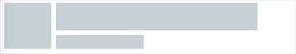

# 一、何为骨架屏
简单来说，骨架屏就是在页面内容未加载完成的时候，先使用一些图形进行占位，待内容加载完成之后再把它替换掉。这个技术在一些以内容为主的APP和网页应用较多。骨架屏的作用主要是在网络请求较慢时，提供基础占位，当数据加载完成，恢复数据展示。这样给用户一种很自然的过渡，不会造成页面长时间白屏或者闪烁等情况。 常见的骨架屏实现方案有ssr服务端渲染和prerender两种解决方案。

# 二、分析Vue页面的内容加载过程
为了简单起见，我们使用`vue-cli`搭配`webpack-simple`这个模板来新建项目：

这时我们便获得了一个最基本的Vue项目
```$xslt
├── package.json
├── src
│   ├── App.vue
│   ├── assets
│   └── main.js
├── index.html
└── webpack.conf.js
```
安装完了依赖以后，便可以通过npm run dev去运行这个项目了。但是，在运行项目之前，我们先看看入口的html文件里面都写了些什么。
```html
<!DOCTYPE html>
<html lang="en">
  <head>
    <meta charset="utf-8">
    <title>vue-skeleton</title>
  </head>
  <body>
    <div id="app"></div>
    <script src="/dist/build.js"></script>
  </body>
</html>
```
可以看到，DOM里面有且仅有一个div#app，当js被执行完成之后，此div#app会被整个替换掉，因此，我们可以来做一下实验，在此div里面添加一些内容：
```html
<div id="app">
  <p>Hello skeleton</p>
  <p>Hello skeleton</p>
  <p>Hello skeleton</p>
</div>
```
打开chrome的开发者工具，在Network里面找到throttle功能，调节网速为“Slow 3G”，刷新页面，就能看到页面先是展示了三句“Hello skeleton”，待js加载完了才会替换为原本要展示的内容。


现在，我们对于如何在Vue页面实现骨架屏，已经有了一个很清晰的思路——在div#app内直接插入骨架屏相关内容即可。
# 三、易维护方案
显然，手动在`div#app`里面写入骨架屏内容是不科学的，我们需要一个扩展性强且自动化的易维护方案。既然是在Vue项目里，我们当然希望所谓的骨架屏也是一个`.vue`文件，它能够在构建时由工具自动注入到`div#app`里面。
首先，我们在`/src`目录下新建一个`Skeleton.vue`文件，其内容如下：
````html
<template>
  <div class="skeleton">
    <div class="skeleton-head"></div>
    <div class="skeleton-body">
      <div class="skeleton-title"></div>
      <div class="skeleton-content"></div>
    </div>
  </div>
</template>

<style>
  .skeleton {
    padding: 10px;
  }

  .skeleton .skeleton-head,
  .skeleton .skeleton-title,
  .skeleton .skeleton-content {
    background: rgb(194, 207, 214);
  }

  .skeleton-head {
    width: 100px;
    height: 100px;
    float: left;
  }

  .skeleton-body {
    margin-left: 110px;
  }

  .skeleton-title {
    width: 500px;
    height: 60px;
    transform-origin: left;
    animation: skeleton-stretch .5s linear infinite alternate;
  }

  .skeleton-content {
    width: 260px;
    height: 30px;
    margin-top: 10px;
    transform-origin: left;
    animation: skeleton-stretch .5s -.3s linear infinite alternate;
  }

  @keyframes skeleton-stretch {
    from {
      transform: scalex(1);
    }
    to {
      transform: scalex(.3);
    }
  }
</style>
````
接下来，再新建一个skeleton.entry.js入口文件：
```js
import Vue from 'vue'
import Skeleton from './Skeleton.vue'

export default new Vue({
  components: {
    Skeleton
  },
  template: '<skeleton />'
})
```
在完成了骨架屏的准备之后，就轮到一个关键插件`vue-server-renderer`登场了。该插件本用于服务端渲染，但是在这个例子里，我们主要利用它能够把`.vue`文件处理成`html`和`css`字符串的功能，来完成骨架屏的注入，流程如下：

# 四、方案实现
根据流程图，我们还需要在根目录新建一个webpack.skeleton.conf.js文件，以专门用来进行骨架屏的构建。
```js
const path = require('path')
const webpack = require('webpack')
const nodeExternals = require('webpack-node-externals')
const VueSSRServerPlugin = require('vue-server-renderer/server-plugin')

module.exports = {
  target: 'node',
  entry: {
    skeleton: './src/skeleton.entry.js'
  },
  output: {
    path: path.resolve(__dirname, './dist'),
    publicPath: '/dist/',
    filename: '[name].js',
    libraryTarget: 'commonjs2'
  },
  module: {
    rules: [
      {
        test: /\.css$/,
        use: [
          'vue-style-loader',
          'css-loader'
        ]
      },
      {
        test: /\.vue$/,
        loader: 'vue-loader'
      }
    ]
  },
  externals: nodeExternals({
    whitelist: /\.css$/
  }),
  resolve: {
    alias: {
      'vue$': 'vue/dist/vue.esm.js'
    },
    extensions: ['*', '.js', '.vue', '.json']
  },
  plugins: [
    new VueSSRServerPlugin({
      filename: 'skeleton.json'
    })
  ]
}
```
可以看到，该配置文件和普通的配置文件基本完全一致，主要的区别在于其`target: 'node'`，配置了`externals`，以及在`plugins`里面加入了`VueSSRServerPlugin`。在`VueSSRServerPlugin`中，指定了其输出的json文件名。我们可以通过运行下列指令，在`/dist`目录下生成一个`skeleton.json`文件：
```html
webpack --config ./webpack.skeleton.conf.js
```
这个文件在记载了骨架屏的内容和样式，会提供给vue-server-renderer使用。

接下来，在根目录下新建一个skeleton.js，该文件即将被用于往index.html内插入骨架屏。
```js

const fs = require('fs')
const { resolve } = require('path')

const createBundleRenderer = require('vue-server-renderer').createBundleRenderer

// 读取`skeleton.json`，以`index.html`为模板写入内容
const renderer = createBundleRenderer(resolve(__dirname, './dist/skeleton.json'), {
  template: fs.readFileSync(resolve(__dirname, './index.html'), 'utf-8')
})

// 把上一步模板完成的内容写入（替换）`index.html`
renderer.renderToString({}, (err, html) => {
  fs.writeFileSync('index.html', html, 'utf-8')
})
```
> 注意，作为模板的html文件，需要在被写入内容的位置添加<!--vue-ssr-outlet-->占位符，本例子在div#app里写入：
```html
<div id="app">
 <!--vue-ssr-outlet-->
</div>
```
接下来，只要运行node skeleton.js，就可以完成骨架屏的注入了。运行效果如下：
```html
<!DOCTYPE html>
<html lang="en">
  <head>
    <meta charset="utf-8">
    <title>vue-skeleton</title>
  <style data-vue-ssr-id="cf7fd5a4:0">
.skeleton {
  padding: 10px;
}
.skeleton .skeleton-head,
.skeleton .skeleton-title,
.skeleton .skeleton-content {
  background: rgb(194, 207, 214);
}
.skeleton-head {
  width: 100px;
  height: 100px;
  float: left;
}
.skeleton-body {
  margin-left: 110px;
}
.skeleton-title {
  width: 500px;
  height: 60px;
  transform-origin: left;
  animation: skeleton-stretch .5s linear infinite alternate;
}
.skeleton-content {
  width: 260px;
  height: 30px;
  margin-top: 10px;
  transform-origin: left;
  animation: skeleton-stretch .5s -.3s linear infinite alternate;
}
@keyframes skeleton-stretch {
from {
    transform: scalex(1);
}
to {
    transform: scalex(.3);
}
}
</style></head>
  <body>
  <div id="app">
    <div data-server-rendered="true" class="skeleton"><div class="skeleton-head"></div> <div class="skeleton-body"><div class="skeleton-title"></div> <div class="skeleton-content"></div></div></div>
  </div>
    <script src="/dist/build.js"></script>
  </body>
</html>
<template>
  <div class="skeleton">
    <div class="skeleton-head"></div>
    <div class="skeleton-body">
      <div class="skeleton-title"></div>
      <div class="skeleton-content"></div>
    </div>
  </div>
</template>
<style>
  .skeleton {
    padding: 10px;
  }

  .skeleton .skeleton-head,
  .skeleton .skeleton-title,
  .skeleton .skeleton-content {
    background: rgb(194, 207, 214);
  }

  .skeleton-head {
    width: 100px;
    height: 100px;
    float: left;
  }

  .skeleton-body {
    margin-left: 110px;
  }

  .skeleton-title {
    width: 500px;
    height: 60px;
    transform-origin: left;
    animation: skeleton-stretch .5s linear infinite alternate;
  }

  .skeleton-content {
    width: 260px;
    height: 30px;
    margin-top: 10px;
    transform-origin: left;
    animation: skeleton-stretch .5s -.3s linear infinite alternate;
  }

  @keyframes skeleton-stretch {
    from {
      transform: scalex(1);
    }
    to {
      transform: scalex(.3);
    }
  }
</style>
```
来看看效果：



